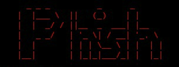
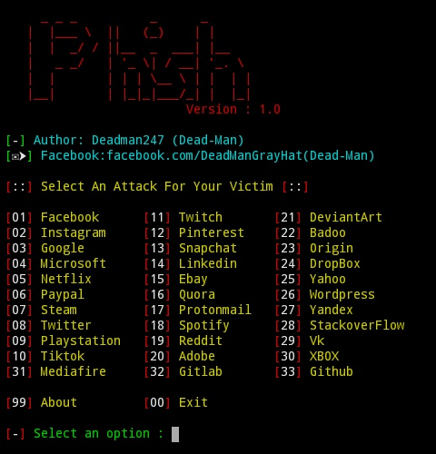

<!-- Phish -->
<h1 align="center">Phish</h1><p align="center">
<p align="center">

</p>
<p align="center">
<a href="#"></a>
</p>
<h1 align="center">Dead-Man</h1><p align="center">
<h1 align="center">
  
  </h1><p align="center">
<p align="center">
  
  
  
  
  
</p>

<p align="center">

  
  
  
</p>

<p align="center">A beginners friendly, Automated phishing tool with 30+ templates.</p>


<H4 align="Left">Features</h4>

<H5 align="Left">Latest and updated login pages.</h5>
<H5 align="Left">Mask URL support </h5>
<H5 align="Left">Beginners friendly</h5>
<H5 align="Left">Docker support (checkout 👉docker-legacy👈 branch)</h5>
<H5 align="Left">Multiple tunneling options</h5>
    <H5 align="Left"> • Localhost
    <H5 align="Left"> • Ngrok (With or without hotspot)</h5>


<H4 align="Left"> Installation</h4>

# Just, Clone this repository

- `git clone git://github.com/Deadman247/Phish`

## Tool run
- `cd phish`
- `bash phish.sh`


- On first launch, It'll install the dependencies and that's it. `Phish` is installed.

### Run on Docker
```
$ docker pull Deadman247/Phish
$ docker run --rm -it Deadman247/Phish
```

### Dependencies

**`Phish`** requires following programs to run properly - 
- `php`
- `wget`
- `curl`
- `git`

> All the dependencies will be installed automatically when you run `Phish` for the first time.
<h3 align="center">
:: Phish ::
</h3>
<p align="center">

</p>

> Supported Platform : **`Termux`**, **`Ubuntu/Debian/Kali`**, **`Arch Linux/Manjaro`**, **`Fedora`**

### Special Thanks :

- [**Dead-Man**](https://github.com/Deadman247)

### Find Me on :
<p align="left">
  <a href="https://github.com/Deadman247" target="_blank"></a>
  <a href="https://www.facebook.com/DeadManGrayHat" target="_blank"></a>
  <a href="https://m.me/DeadManGrayHat" target="_blank"></a>
</p>
